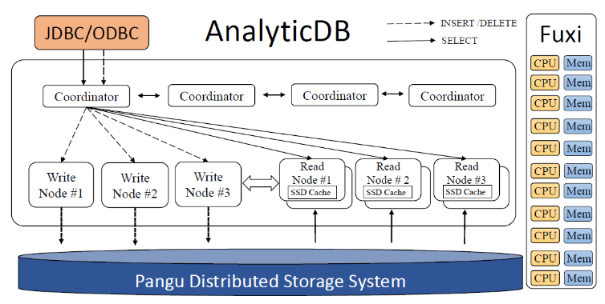
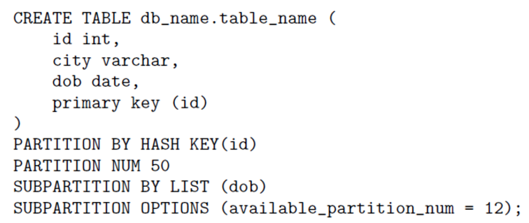
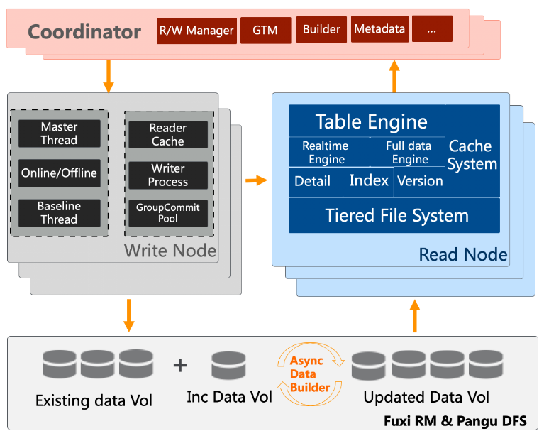

已有的分析型数据库（以下简称OLAP）诸如Impala、Pinot、Druid等，

总结了OLAP系统在设计的过程中应该解决的问题：低延迟、数据新鲜度、多样性、低成本、高扩展性、高可靠性。

# AnalyticDB架构

AnalyticDB的整体架构如下图：

图3 AnalyticDB架构图

每个模块的具体描述如下：

- Coordinator（协调节点）：协调节点负责接收JDBC/ODBC连接发过来的请求，并将请求分发给读节点或者写节点。
- Write Node（写节点）：只处理写请求（如INSERT、DELETE、UPDATE）的节点。
- Read Node（读节点）：只处理读请求（如SELECT）的节点。
- Pangu（盘古）：高可靠分布式存储系统，是AnalyticDB依赖的基础模块。写节点会将写请求的数据刷到盘古上进行持久化。
- Fuxi（伏羲）：资源管理与任务调度系统，是AnalyticDB依赖的基础模块。伏羲合理使用集群机器的空闲资源，以进行相关计算任务的异步调度执行。

## 表分区

为便于大规模分析处理，AnalyticDB对数据表进行分区。AnalyticDB数据表有两个分区级别：一级分区和二级分区。图4展示了创建带有一级分区、二级分区表的DDL语句：一级分区有50个分区，分区键为id列；二级分区有12个分区，分区键为dob列。数据行依据其包含的一级分区键的hash值，对应到不同的一级分区。通常，选择具有较高基数（cardinality）的列作为一级分区键，以保证数据行能均匀地分布到每个一级分区，最大化并行。用户还可以根据需要定义二级分区，以便进行数据的自动管理。二级分区拥有最大分区数，当二级分区的实际数目超过了这个最大分区数后，最老的二级分区会被自动删除。通常，选择时间列（天、周或月）作为二级分区列，这样，包含相同时间序列的数据行，会被划分到同一个二级分区中。

图4 创建带有分区的数据表的DDL

## 读写分离

传统OLAP系统在同一个链路上同时处理读写请求，因此，所有的并发读写请求都共享同一个资源池，也会互相影响。但是当读写并发同时非常大时，这种设计会由于过度的资源竞争而导致不好的性能。如图5所示，为了解决这个问题，同时确保读和写的高性能，AnalyticDB采用的架构为读写分离架构，即AnalyticDB有独立的读写节点各自处理读写请求，且写节点和读节点完全互相隔离。

图5 AnalyticDB读写分离

==写节点：==某个写节点会被选为主节点，其他写节点选为从节点，主节点和从节点之间通过ZooKeeper来进行通信。每个节点会独立负责某些一级分区的数据，主节点的任务就是决定每个节点负责哪些一级分区。协调节点会将写请求分发到对应的写节点上，写节点收到请求后，会将写SQL语句放到内存buffer中，这些buffer中的SQL语句称为log数据。写节点会将buffer中的log数据刷到盘古上，当刷盘古成功后，写节点会返回一个版本号（即LSN）给协调节点，表示写完成了。每个一级分区在其对应的写节点上，都会独立地对应一个版本号，每次写节点将某个一级分区的log数据刷到盘古后，都会增大这个版本号，并将最新版本号返回给协调节点。

当盘古上的log数据达到一定规模时，AnalyticDB会在伏羲上启动MapReduce任务，以将log数据转换成真实存储数据+索引。

读节点：每个读节点也独立负责某些一级分区的数据。在每个读节点初始化时，它会从盘古上读取最新版本数据（包括索引）。之后，基于这份数据，读节点会从写节点的内存buffer中将写请求log周期性地拉取过来，并在本地进行replay，replay之后的数据不会再存储到盘古中。读节点根据replay之后的数据，服务到来的读请求。

由于读节点需要去从写节点上拉取写请求数据，因此读节点为用户提供了两种可见性级别：实时（real-time）可见和延时（bounded-staleness）可见。实时可见允许读节点立即读到写节点写入的数据，延时可见允许读节点在一段时间后才读到写节点上写入的数据。AnalyticDB默认使用的可见性级别为延时可见。

当可见性级别选择为实时可见时，AnalyticDB采用了版本校验（version verification）机制来确保读写节点的同步。当用户执行完写请求后，他/她再发送一个查询请求到协调节点。协调节点会从对应写节点上获取最新的版本号（记为V1），连同查询请求一起下发给对应的读节点。读节点上在进行本地replay的时候，也会存有目前已经replay的版本号（记为V2）。读节点会比较V1和V2的大小：如果V1小于等于V2，那么读节点直接基于本地replay的数据执行查询；如果V1大于V2，那么读节点会从对应写节点上拉取直到V1的log数据，replay后再执行查询。需要强调的是，当可见性级别为延时可见时，协调节点在下发查询请求之前，不会实时地从对应写节点上获取最新版本号，而是使用缓存的之前写节点返回给自己的版本号（由于存在很多协调节点，所以某个协调节点上缓存的版本可能不是最新版本）。

## 可靠性与扩展性

- 可靠性。
- AnalyticDB的读节点和写节点均具有高可靠性。对于写节点来说，当某个从节点失效的时候，主节点会将其负责的一级分区均匀地分配给其他正常的从节点。当主节点失效的时候，新的主节点会被重新选出来进行替代。对于读节点来说，用户可以指定读节点的副本个数（默认为2），不同副本会被放到不同的物理机上，以提供高可靠性。当某个读节点失效时，协调节点会将读请求自动下发到其他副本上。需要强调的是，某个写节点的失效，也不会影响读节点正常地拉取log数据和replay数据。因为log数据是持久化在盘古上的，在写节点失效地时候，读节点可以直接去盘古上拉取log数据。
- 扩展性。
- AnalyticDB的读节点和写节点也具有高可扩展性。当一个新的写节点加入时，主节点会自动调整一级分区的分配，保证负载均衡。读节点的可扩展性也是由相同的机制保证的，只不过对于读节点，调整一级分区分配的是协调节点。

